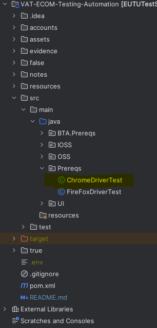
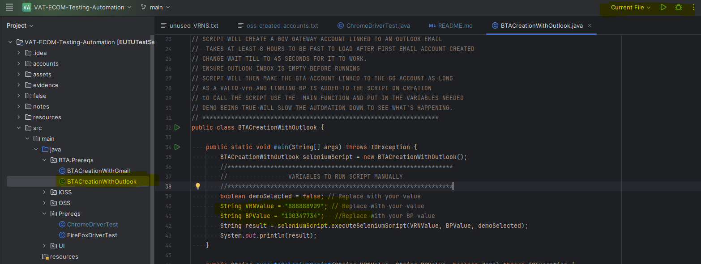
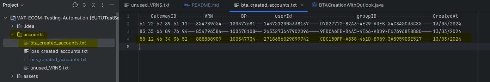
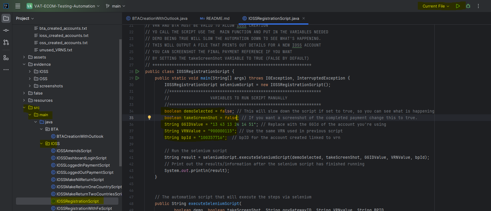
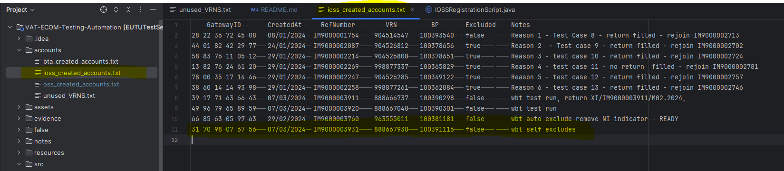

# READ ME
This automation set up can not be done on HMRC laptops. 
## Pre requisites
1. Intellij Set up
2. OpenVPN set up
3. ZScaler turned off

Guides for the above prerequisites can be emailed out or found in the sharepoint. 

## Installation
1. Create a new intellij project from version control with the [GitHub Repository](https://github.com/MaspTestTeam/TestAutomation).

2. Press clone and wait for the build, this may take a few minutes to download and install all the relevant packages.
3. To find all the automation scripts navigate into the main directory then into src/main/java.

## Setting up the project
1. Before using the scripts you need the .env file which holds all the sensitive information. Reach out to a member of the team for the file.
2. Create the .env file in the base directory.

3. To check selenium and the chromedriver are in sync you can first run a test script -> ChromeDriverTest.Java. This is located in src/main/java/Prereqs.

4. If the script does not run and Chrome cant load the page, remember to turn off service Status in Zscaler (found in your desktop tray). Use 'HMRC sit enviro' as the reason.

## Using the scripts
**Note:** All scripts follow the same structure of main() that calls executeSeleniumScript() function. The main() is where you will input any variables that change. 
### BTA Creation
1. Open the BTACreationWithOutlook file and change the values of the VRN and BP for the account you are going to make.
2. You can then run the file by changing the option on the top bar to 'Current File' and press play.

3. Once completed, if the final step is 202 the information for the BTA account created is stored in accounts/bta_Created_accounts.txt.
4. Open up the above file and see the gov gateway Id and any other information about the account you might need.

### Registering for OSS/IOSS
**NOTE:** The OSS and IOSS script structure and behaviour is the same to running one or the other requires the same steps. 
For this example I will demonstrate the OSS registering
1. You will need the Gov Gateway ID, VRN and BP number for the account you are registering. This can be found easily in the bta_Created_accounts.txt
2. Open the IOSSRegistrationScript and change the VRN, BP and GG in the main() and run the file te same as the BTA using Current File and press play.

3. Sit back and wait for the creation of the account. The final step can take a few seconds so wait for the terminal to print out the test is completed. There is a delay waiting for the IOSS reg number to be shown to save it.
4. To find the information and details for the IOSS registration they are saved to accounts/ioss_created_Accounts.txt.

5. You can edit this file with any notes you want, it is not read by any script and only wrote to with new accounts appended to the bottom.

The same steps for OSS are repeated as above but using the OSSRegistrationScript and details are saved to oss_Created_accounts.txt.

## Editing the scripts
Once the project is set up you can create accounts you are free to use the project how you want. You can create a new script or edit ones already there.

The scripts are step by step so if something gets stuck it should be clear to find where and how to change any options.

Example of some of the steps for IOSS

If you wanted to change the script to declare items 135 or more, then you can inspect the website pae and find the id of the button you want to click instead and click that instead.

## Addition Info
You can store and unused VRNS and BPS in accounts/unused_VRNS.txt if you collect a few at a time.

If you get stuck you should know this stack is selenium, java with chrome driver if you are searching for information on Google.

Common error: Your chrome and web-driver are out of sync due to updates. This requires you to install the updated chromedriver which can be found at [Here.](https://googlechromelabs.github.io/chrome-for-testing/)

If you get errors with the UI package, you can delete the entire package, it is there as an extra but not needed.

If you start editing your scripts you can set up a GitHub repository on an account and push it there. 
