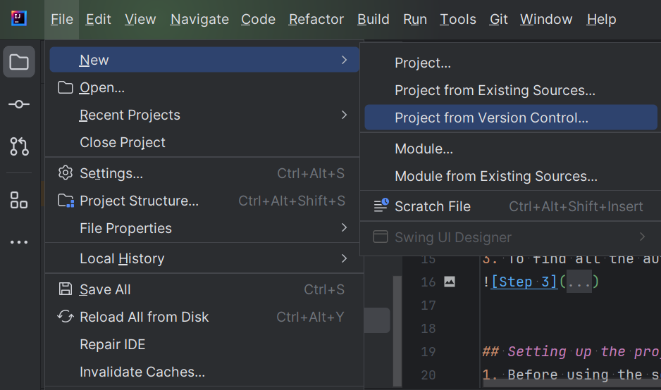
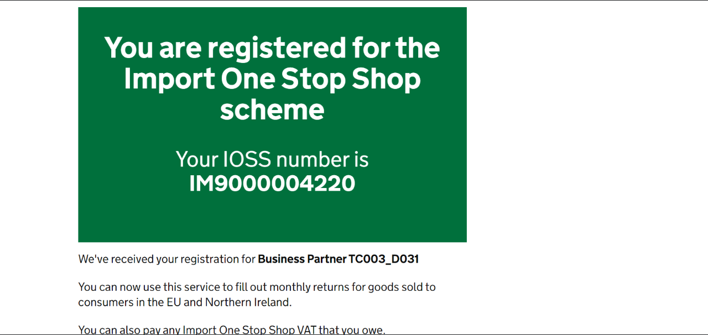
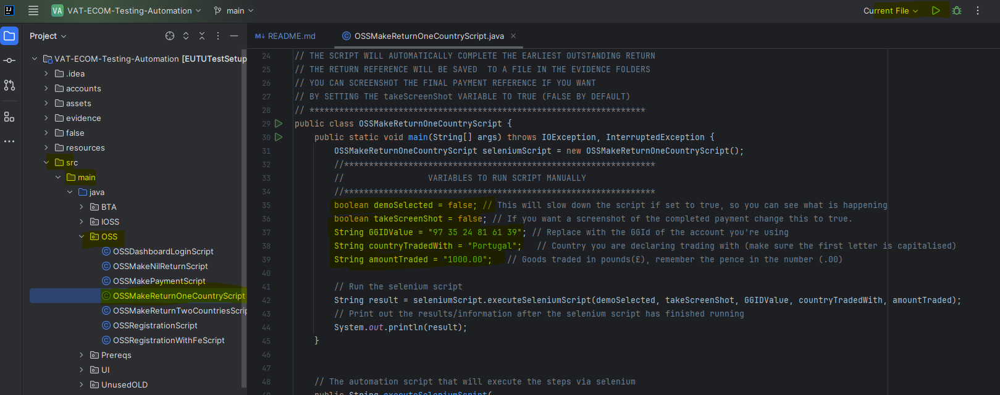
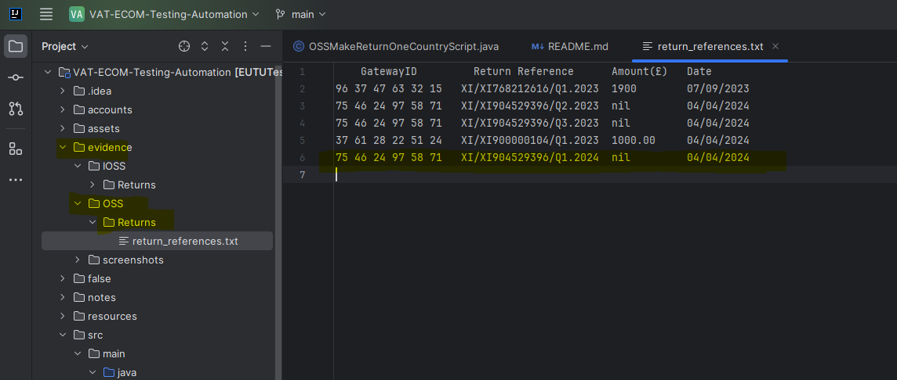
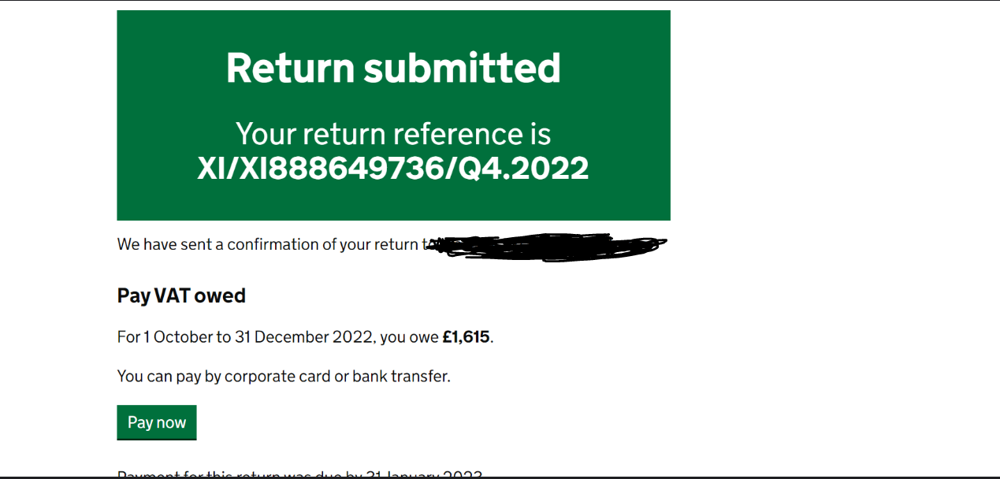
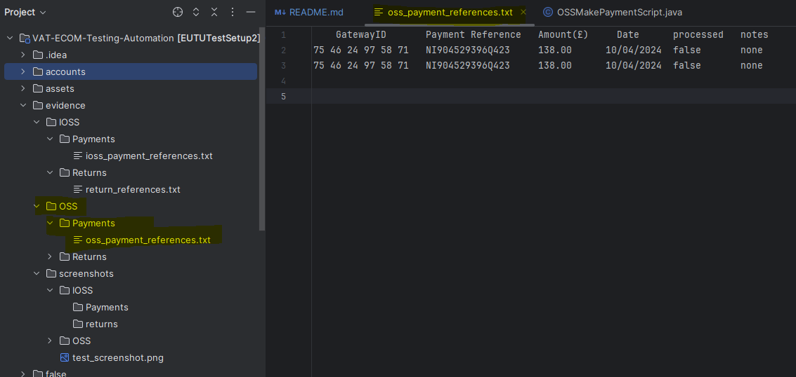
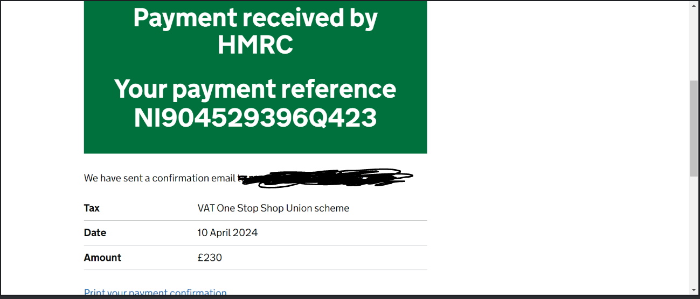

# READ ME
This automation set up can not be done on Stride laptops. 
## Pre requisites
1. Intellij Set up
2. OpenVPN set up
3. ZScaler turned off

Guides for the above prerequisites can be emailed out or found in the sharepoint. 

## Installation
1. Create a new intellij project from version control with the [GitHub Repository](https://github.com/MaspTestTeam/TestAutomation).

2. Press clone and wait for the build, this may take a few minutes to download and install all the relevant packages.
3. To find all the automation scripts navigate into the main directory then into src/main/java.

## Setting up the project
1. Before using the scripts you need the .env file which holds all the sensitive information. Reach out to a member of the team for the file.
2. Create the .env file in the base directory.

3. To check selenium and the chromedriver are in sync you can first run a test script -> ChromeDriverTest.Java. This is located in src/main/java/Prereqs.

4. If the script does not run and Chrome cant load the page, remember to turn off service Status in Zscaler (found in your desktop tray). Use 'HMRC sit enviro' as the reason.

## Using the scripts
**Note:** All scripts follow the same structure of main() that calls executeSeleniumScript() function. The main() is where you will input any variables that change. 
### BTA Creation
1. Open the BTACreationWithOutlook file and change the values of the VRN and BP for the account you are going to make.
2. You can then run the file by changing the option on the top bar to 'Current File' and press play.

3. Once completed, if the final step is 202 the information for the BTA account created is stored in accounts/bta_Created_accounts.txt.
4. Open up the above file and see the gov gateway Id and any other information about the account you might need.

## Taking Screenshots
Taking a screenshot is optional and turned off by default. Set the takeScreenShot variable to true on the script you want to take a screenshot of.
To take a screenshot of your final payment/return/registration reference all you need to do it set the takeScreenShot variable to true.
By default, these variables are false which will prevent unnecessary extra files being added.
All screenshots are saved to the screenshot folders within evidence/screenshots.

### Registering for OSS/IOSS
**NOTE:** The OSS and IOSS script structure and behaviour is the same to running one or the other requires the same steps. 
For this example I will demonstrate the IOSS registration.
1. You will need the Gov Gateway ID, VRN and BP number for the account you are registering. This can be found easily in the bta_Created_accounts.txt
2. Open the IOSSRegistrationScript and change the VRN, BP and GG in the main() and run the file the same as the BTA using Current File and press play.

3. Sit back and wait for the creation of the account. The final step can take a few seconds so wait for the terminal to print out the test is completed. There is a delay waiting for the IOSS reg number to be shown to save it.
4. To find the information and details for the IOSS registration they are saved to accounts/ioss_created_Accounts.txt.

5. You can edit this file with any notes you want, it is not read by any script and only wrote to with new accounts appended to the bottom.
6. Note: Screenshots will be saved to evidence/screenshots/IOSS/Registrations and look like the example below

The same steps for OSS are repeated as above but using the OSSRegistrationScript and details are saved to oss_Created_accounts.txt.

### Making a return
**NOTE:** The OSS and IOSS script structure is the same. For this example I will demonstrate the OSS behaviour.
1. You will need Gov GatewayID of the account making a return.
2. The account needs outstanding returns due before the script can be run. 
3. Enter the country you are declaring a trade with and for how much.

4. Sit back and wait for the script to run, It will collect the return reference at the end you don't need to note it down yourself.
5. To find the information and details for the return go to evidence/OSS/Returns/oss_return_references.txt

6. If you need to make a return to 2 countries then you can use the OSSMakeReturnTwoCountriesScript.java and follow the same steps as above.
7. Note: Screenshots will be saved to evidence/screenshots/OSS/Returns and look like the example below.

### Making a payment
**NOTE:** The OSS and IOSS script structure is the same. For this example I will demonstrate the OSS behaviour.
1. To make a payment you will need a Gov GatewayID of the account making a payment.
2. The account needs to have payments due, one or multiple. The script will pay the most overdue.
3. You can pay partially or full. To pay full set the percentPayment to 100, this means 100%.

4. If you want a screenshot you can set the takeScreenShot variable to true.
5. Sit Back and wait for the script to run. It will collect the payment reference always on completion and put it in evidence/OSS/Payments/oss_payment_references.txt

6. Note: Screenshots will be saved to evidence/screenshots/OSS/Payments and look like the example below.

## Editing the scripts
Once the project is set up you can create accounts you are free to use the project how you want. You can create a new script or edit ones already there.

The scripts are step by step so if something gets stuck it should be clear to find where and how to change any options.

Example of some of the steps for IOSS

If you wanted to change the script to declare items 135 or more, then you can inspect the website pae and find the id of the button you want to click instead and click that instead.

## Addition Info
You can store and unused VRNS and BPS in accounts/unused_VRNS.txt if you collect a few at a time.

If you get stuck you should know this stack is selenium, java with chrome driver if you are searching for information on Google.

Common error: Your chrome and web-driver are out of sync due to updates. This requires you to install the updated chromedriver which can be found at [Here.](https://googlechromelabs.github.io/chrome-for-testing/) 
If you are having issues deleting or moving the file into resources you need to kill all chromedriver instances.
To do this go to your command prompt or terminal and run the following command "taskkill /f /im chromedriver.exe".

If you get errors with the UI package, you can delete the entire package, it is there as an extra but not needed.

If you start editing your scripts you can set up a GitHub repository on an account and push it there. 

If you are out of sync with the repo the fastest way to get going again would be to make a new project and clone the repo again. Just make sure you keep your accounts copied and saved somewhere else and can drag them back in once the new project has been initialised. 
